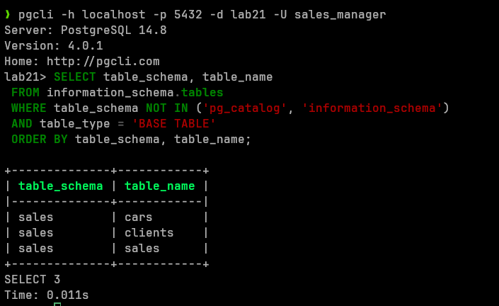

# Лабораторная 2_1
## Выполнил студент группы Б20-505, Полищук Максим

## Структура БД
Запрос на создание таблиц в БД:
```SQL
CREATE TABLE cars (
    car_id SERIAL PRIMARY KEY,
    brand VARCHAR(50),
    model VARCHAR(50),
    year INT,
    price DECIMAL,
    color VARCHAR(30),
    mileage INT
);
CREATE TABLE clients (
    client_id SERIAL PRIMARY KEY,
    first_name VARCHAR(50),
    last_name VARCHAR(50),
    phone_number VARCHAR(15),
    email VARCHAR(50)
);
CREATE TABLE sales (
    sale_id SERIAL PRIMARY KEY,
    car_id INT REFERENCES cars(car_id),
    client_id INT REFERENCES clients(client_id),
    sale_date DATE,
    sale_price DECIMAL
);
CREATE TABLE employees (
    employee_id SERIAL PRIMARY KEY,
    first_name VARCHAR(50),
    last_name VARCHAR(50),
    position VARCHAR(50),
    hire_date DATE,
    salary DECIMAL
);
CREATE TABLE service (
    service_id SERIAL PRIMARY KEY,
    car_id INT REFERENCES cars(car_id),
    service_date DATE,
    description TEXT,
    cost DECIMAL
);
```

Структура:


## Определить, в какой схеме находятся таблицы Вашей базы данных

Запрос:
``` SQL
SELECT table_schema, table_name
FROM information_schema.tables
WHERE table_schema NOT IN ('information_schema', 'pg_catalog')
ORDER BY table_schema, table_name;
```
Вывод:
```
+--------------+------------+
| table_schema | table_name |
|--------------+------------|
| public       | cars       |
| public       | clients    |
| public       | employees  |
| public       | sales      |
| public       | service    |
+--------------+------------+
```

## Следует ли изменить схему? Следует ли создать несколько отдельных схем для выбранной предметной области? Почему?

Базово это не является проблем и можно оставить все таблицы привязанными к схеме "public". Но для того чтобы обеспечить разделение на различные уровни доступа можно создать отдельные схемы для доступа к таблицам (также новые схемы позволят упростить создание новых таблиц, их можно будет привязать к уже существующим схемам).

## Следует ли создать несколько отдельных схем для выбранной предметной области? Почему?

Дла лабораторной работы были придуманы роли:
- custom_dba - администратор базы данных, имеет полный доступ
- sales_manager - менеджер по продажам, имеет доступ к списку машин, клиентов и журналу продаж
- service_employee - сотрудник сервисного центра, имеет доступ к сервисному журналу и списку машин
- finance_manager - финансовый менеджер, имеет доступ к журналу продаж и сервисному журнаду, списку сотрудников
- hr_manager - сотрудник отдела кадров, имеет доступ к списку сотрудников
- sales_consultant - продавец-консультант, имеет доступ к списку клиентов

## Какие системные и объектные привилегии потребуются каждой роли? Понадобятся ли вложенные роли?
```SQL
-- DBA
CREATE ROLE custom_dba WITH LOGIN PASSWORD 'db_pass';
-- Выдача административных прав
GRANT ALL PRIVILEGES ON DATABASE lab21 TO db_admin;

-- менеджер по продажам
CREATE ROLE sales_manager WITH LOGIN PASSWORD 'manager_pass';
-- Выдача доступа к нужным таблицам
GRANT SELECT, INSERT, UPDATE ON cars, clients, sales TO sales_manager;

-- сотрудник сервисного центра
CREATE ROLE service_employee WITH LOGIN PASSWORD 'service_pass';
-- Выдача доступа к таблицам service и cars
GRANT SELECT, INSERT, UPDATE ON service, cars TO service_employee;

-- финансовый менеджер
CREATE ROLE finance_manager WITH LOGIN PASSWORD 'finmanager_pass';
-- Выдача прав на чтение соответствующих таблиц
GRANT SELECT ON sales, service, employees TO finance_manager;

-- HR-менеджер
CREATE ROLE hr_manager WITH LOGIN PASSWORD 'hr_pass';
-- Выдача прав на чтение и обновление таблицы employees
GRANT SELECT, INSERT, UPDATE ON employees TO hr_manager;

-- продавец-консультант
CREATE ROLE sales_consultant WITH LOGIN PASSWORD 'sales_pass';
-- Выдача ограниченных прав на таблицы cars и clients
GRANT SELECT ON cars TO sales_consultant;
GRANT INSERT, SELECT ON clients TO sales_consultant;
```

Создание схем:
```SQL
CREATE SCHEMA sales;
CREATE SCHEMA service;
CREATE SCHEMA hr;
```

Переназначение таблица к схемам:
```SQL
ALTER TABLE cars SET SCHEMA sales;
ALTER TABLE clients SET SCHEMA sales;
ALTER TABLE sales SET SCHEMA sales;

ALTER TABLE service SET SCHEMA service;

ALTER TABLE employees SET SCHEMA hr;
```

Выдача доступов к схемам для ролей:
```SQL
GRANT USAGE ON SCHEMA sales TO sales_manager;
GRANT SELECT, INSERT, UPDATE ON ALL TABLES IN SCHEMA sales TO sales_manager;
GRANT USAGE ON SCHEMA service TO service_employee;
GRANT SELECT, INSERT, UPDATE ON ALL TABLES IN SCHEMA service TO service_employee;
GRANT USAGE ON SCHEMA sales, service, hr TO finance_manager;
GRANT SELECT ON ALL TABLES IN SCHEMA sales, service, hr TO finance_manager;
GRANT USAGE ON SCHEMA hr TO hr_manager;
GRANT SELECT, INSERT, UPDATE ON ALL TABLES IN SCHEMA hr TO hr_manager;
GRANT USAGE ON SCHEMA sales TO sales_consultant;
GRANT SELECT ON ALL TABLES IN SCHEMA sales TO sales_consultant;
```

Теперь схемы выглядят так:
```
+------------+--------------+
| table_name | table_schema |
|------------+--------------|
| employees  | hr           |
| cars       | sales        |
| clients    | sales        |
| sales      | sales        |
| service    | service      |
+------------+--------------+
```

## Подключение к базе данных от лица каждой роли

dba


finance_manager


sales_manager


sales_consultant


service_employee
