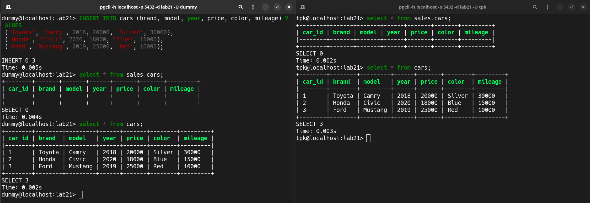
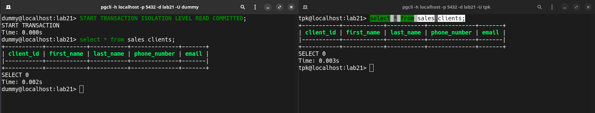
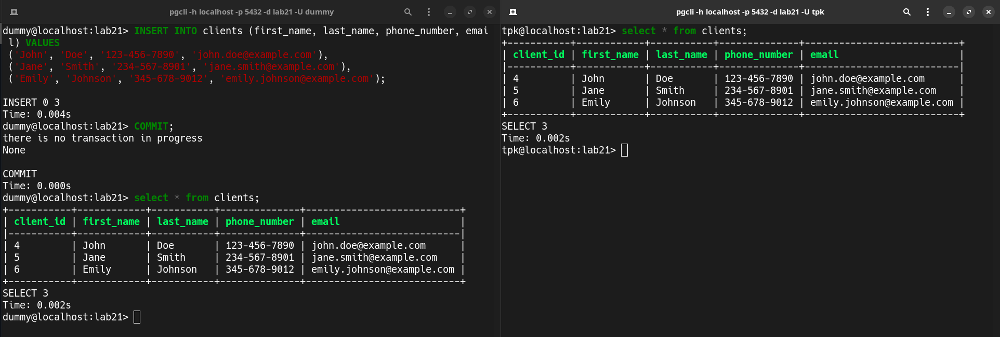

# Лабораторная работа №2-2: «Транзакции. Изоляция транзакций»

Выполнил студент группы Б20-505, Полищук Максим.

В данной лабораторной работе использовалась та же схема базы данных, что и в лабораторной работе `2_1`

Одновременно подключимся к одной и той же БД с двух разных сессий (`dummy` и `tpk`)

## Создать две сессии в Вашей базе данных. Начать транзакцию на уровне изоляции READ COMMITTED в одной из сессий. Изменить и добавить какие-либо данные.

В `dummy` выставлен режим изоляции READ COMMITET, данных в таблице `cars` изначально нет

*Дубль 1*:

| Ничего не сработало т.к. PostgreSQL имеет изначально режим **autocommit**

*Дубль 2*:
Изначально таблица `clients` пустая:

Далее данные вставили только внутри сессии `dummy` потому что выставленный режим изоляции требует прописать `COMMIT`, чтобы сохранить изменения.

Завершаем транзакцию при помощи **ROLLBACK**:

| ROLLBACK отменяет изменения внесенные в последней транзакции, поэтому даже из первой сессии данные пропали и вернулись к тому состоянию, которое было до начала транзакции

Завершаем транзакцию при помощи **COMMIT**:

| COMMIT подтверждаем внесенные за время транзакции изменения, поэтому эти данные можно увидеть и из сессии `tpk`

## Выполнить те же операции для уровней изоляции REPEATABLE READ и SERIALIZABLE. Объяснить различия
### REPEATABLE READ
*Не смог понять как это так, но в левой сессии не должны оборажаться внесенные изменения, должны отображаться данные на момент начала транзакции*

Причем уровень изоляции изменяется, но к примеру команду TRUNCATE выполнить не удается

Ещё одна попытка к изменениям не привела:

### SERIALIZABLE

При попытке одновременного изменения данных PostgreSQL это запрещает и требует завершения первоначальной транзакции:

## Заключение

Знакомство было проведено с тремя ключевыми уровнями изоляции транзакций.

1. **READ COMMITTED**:
    - Уровень изоляции считается базовым.
    - Фиксированные изменения от других транзакций становятся видимыми.
    - Не исключает возможности изменения данных в процессе текущей транзакции.
2. **REPEATABLE READ**:
    - Уровень изоляции выше, чем у READ COMMITTED.
    - Обеспечивает постоянство данных на протяжении транзакции.
    - Запрещает доступ к новым данным, которые соответствуют условиям запроса во время транзакции.
3. **SERIALIZABLE**:
    - Наивысший уровень изоляции.
    - Гарантирует стабильность данных и защищает от изменений, произведенных другими транзакциями во время текущей транзакции.
    - Доступ к данным ограничивается их состоянием на момент начала транзакции.