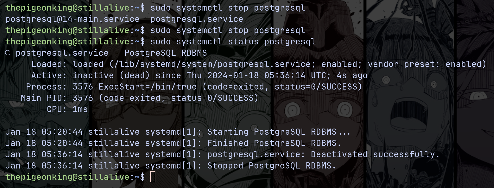
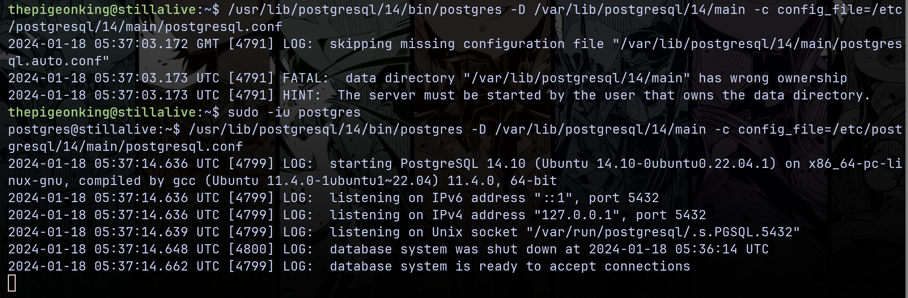
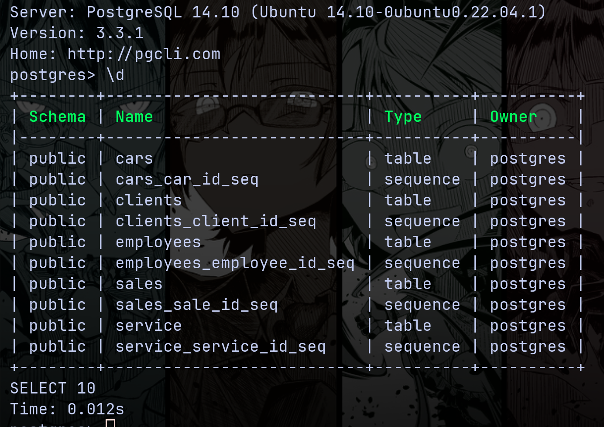
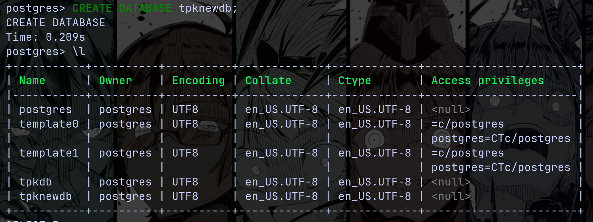
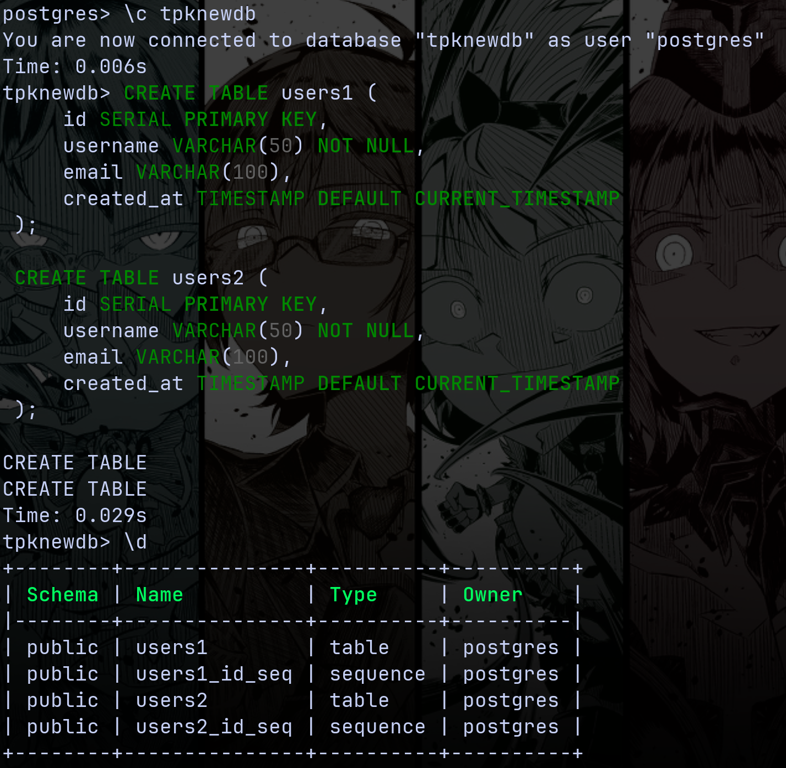
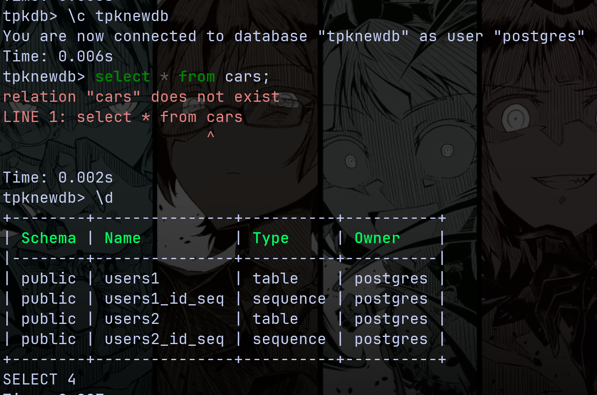
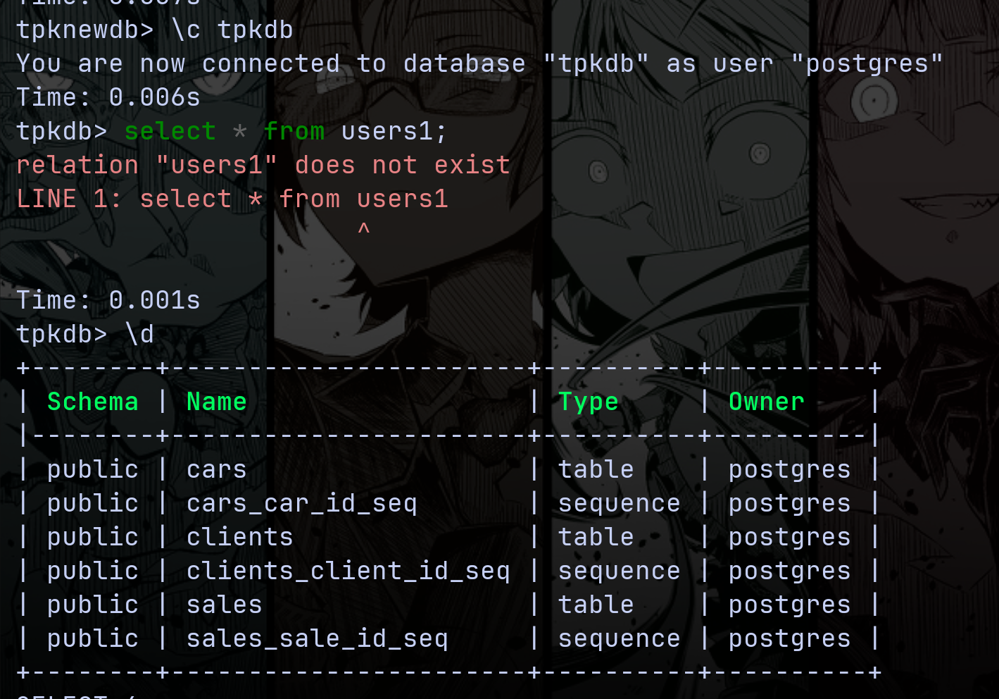

# Лабораторная работа №2-3: «Базовые задачи администрирования СУБД»

Выполнил студент группы Б20-505, Полищук Максим

## Выяснить, в каком месте файловой системы расположен установленный в предыдущих работах кластер баз данных PostgreSQL
```
postgres> SHOW data_directory;
+-----------------------------+
| data_directory              |
|-----------------------------|
| /var/lib/postgresql/14/main |
+-----------------------------+
SHOW
Time: 0.008s
```

## Выяснить, какие файлы хранятся в директории кластера базы данных
Сткруктура директории `/var/lib/postgresql/14/main`
```
postgres@stillalive:~/14$ tre main/ -l 1
main/
├── pg_xact
├── pg_multixact
├── global
├── pg_logical
├── pg_replslot
├── pg_stat
├── postmaster.opts
├── pg_twophase
├── pg_notify
├── pg_stat_tmp
├── pg_subtrans
├── pg_dynshmem
├── pg_commit_ts
├── base
├── PG_VERSION
├── pg_snapshots
├── pg_wal
├── postgresql.auto.conf
├── postmaster.pid
├── pg_serial
└── pg_tblspc
```

- **base**: Хранит данные всех пользовательских баз данных.
- **global**: Содержит глобальные данные кластера.
- **pg_commit_ts**: Информация о временных метках фиксации транзакций.
- **pg_dynshmem**: Для динамической разделяемой памяти.
- **pg_logical**: Информация для логической репликации.
- **pg_multixact**: Информация о мульти-транзакциях.
- **pg_notify**: Информация о NOTIFY командах.
- **pg_replslot**: Информация о слотах репликации.
- **pg_serial**: Информация о сериализации транзакций.
- **pg_snapshots**: Экспортированные снимки данных.
- **pg_stat и pg_stat_tmp**: Статистика работы сервера.
- **pg_subtrans**: Управление подтранзакциями.
- **pg_tblspc**: Ссылки на таблицы в пространствах таблиц.
- **pg_twophase**: Данные о двухфазных фиксациях транзакций.
- **PG_VERSION**: Версия PostgreSQL.
- **pg_wal**: Журналы записи операций (WAL).
- **pg_xact**: Файлы журналов транзакций.
- **postgresql.auto.conf**: Параметры конфигурации через ALTER SYSTEM.
- **postmaster.opts и postmaster.pid**: Опции запуска и идентификатор процесса.

## Выяснить, какой командной строкой запущен экземпляр PostgreSQL

```
thepigeonking@stillalive:~$ ps aux | grep postgres
postgres    3519  0.0  0.3 218328 30564 ?        Ss   05:20   0:00 /usr/lib/postgresql/14/bin/postgres -D /var/lib/postgresql/14/main -c config_file=/etc/postgresql/14/main/postgresql.conf
```

## Выполнить штатное завершение работы сервера PostgreSQL



## Вновь запустить экземпляр PostgreSQL вручную



## Подключиться к экземпляру и проверить его работоспособность



## Создать новую базу данных в кластере. Кто её владелец? Какие объекты в ней содержатся?



| По умолчанию владельцем новой базы данных является пользователь от лица которого была исполнена команда

## Подключиться к новой базе данных и создать в ней несколько пробных объектов



## Убедиться, что из новой базы данных нет доступа к исходной



## Убедиться, что из исходной базы данных нет доступа к новой



## Заключение

В процессе лабораторной работы был получен опыт администрирования баз данных, включая создание и управление кластерами PostgreSQL. Также был исследован концент "контейнерных" баз данных и их функционал.