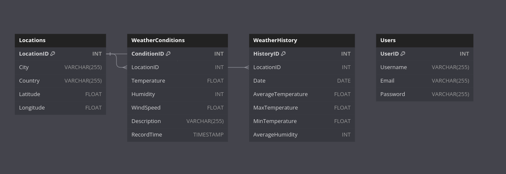
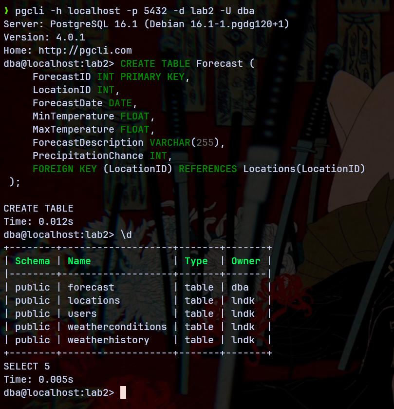
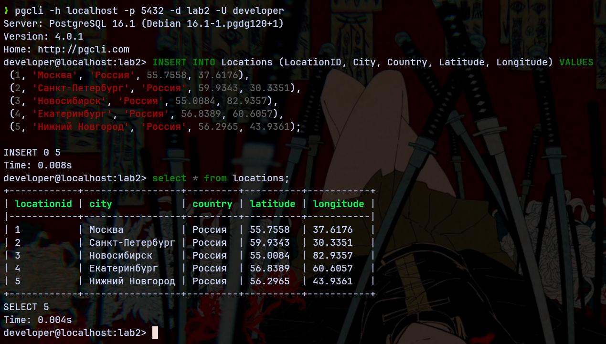
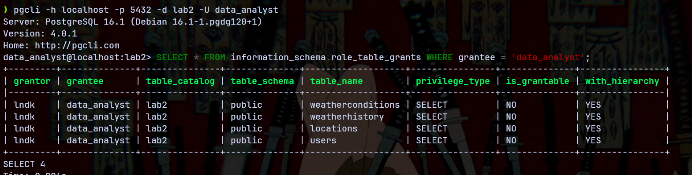
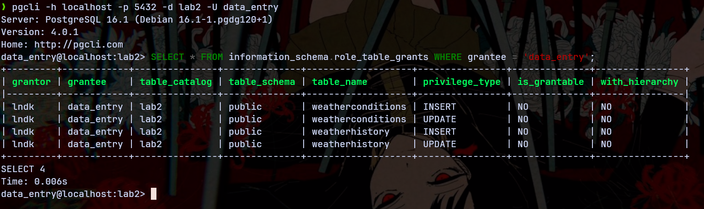
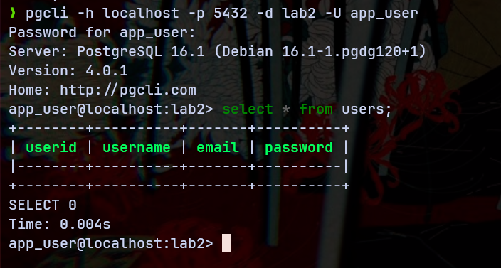

# Лабораторная работа №2-1: «Пользователи. Роли. Привилегии»

Выполнил студент группы Б20-505, Ландаков Павел

## Структура базы данных

За основу была взята структура базы данных метереологического приложения. Все таблицы можно создать при помощи следующего SQL запроса:
```SQL
CREATE TABLE Locations (
    LocationID INT PRIMARY KEY,
    City VARCHAR(255),
    Country VARCHAR(255),
    Latitude FLOAT,
    Longitude FLOAT
);

CREATE TABLE WeatherConditions (
    ConditionID INT PRIMARY KEY,
    LocationID INT,
    Temperature FLOAT,
    Humidity INT,
    WindSpeed FLOAT,
    Description VARCHAR(255),
    RecordTime TIMESTAMP,
    FOREIGN KEY (LocationID) REFERENCES Locations(LocationID)
);

CREATE TABLE WeatherHistory (
    HistoryID INT PRIMARY KEY,
    LocationID INT,
    Date DATE,
    AverageTemperature FLOAT,
    MaxTemperature FLOAT,
    MinTemperature FLOAT,
    AverageHumidity INT,
    FOREIGN KEY (LocationID) REFERENCES Locations(LocationID)
);


CREATE TABLE Users (
    UserID INT PRIMARY KEY,
    Username VARCHAR(255),
    Email VARCHAR(255),
    Password VARCHAR(255)
);
```

**Даграмма классов**:


## Определить, в какой схеме находятся таблицы Вашей базы данных

Определить к какой схеме относятся таблицы можно введя `\d`:
```
lndk@localhost:lab2> \d
+--------+-------------------+-------+-------+
| Schema | Name              | Type  | Owner |
|--------+-------------------+-------+-------|
| public | locations         | table | lndk  |
| public | users             | table | lndk  |
| public | weatherconditions | table | lndk  |
| public | weatherhistory    | table | lndk  |
+--------+-------------------+-------+-------+
```
Или при помощи подобного SQL запроса:
```SQL
SELECT table_name, table_schema 
FROM information_schema.tables
WHERE table_schema NOT IN ('information_schema', 'pg_catalog')
ORDER BY table_schema, table_name;
```
```
+-------------------+--------------+
| table_name        | table_schema |
|-------------------+--------------|
| locations         | public       |
| users             | public       |
| weatherconditions | public       |
| weatherhistory    | public       |
+-------------------+--------------+
```

## Следует ли изменить схему? Следует ли создать несколько отдельных схем для выбранной предметной области? Почему?

Нахождение таблиц в схеме `public` не является чем-то незаконным. Но в соответствии с лабораторной работой для упрощения организации и разделения данных (в перспективе) можно создать несколько отдельных схем и разнести таблицы по ним. Также разделение на схемы облегчит управление доступом и повысит безопасность, потому что можно будет настроить доступ ролей к определенным схемам.


## Определить, какие роли нужны для нормального функционирования Вашей базы данных. Какие системные и объектные привилегии потребуются каждой роли? Понадобятся ли вложенные роли?

Могут потребоваться следующие роли:

- **DBA (админ)**: имеет полный доступ ко всей базе;
- **Разработчик**: CREATE, ALTER, DROP на схемах и объектах, которые они разрабатывают;
- **Аналитик данных**: SELECT на необходимых таблицах;
- **Оператор ввода данных**: INSERT, UPDATE на определенных таблицах;
- **Пользователь приложения**: SELECT, UPDATE на ограниченном наборе данных, связанных с пользовательским интерфейсом.

Базово вложенные роли не являются необходимыми, но если к примеру потребуется роль "Модератор", то его права могут быть наследованы от *Пользователя приложения* и дополнительно расширены до возможностей редактирования других пользователей.

## Создать роли и выдать им необходимые объектные и системные привилегии

SQL запрос:
```SQL
CREATE ROLE dba WITH LOGIN PASSWORD 'strong_password_dba' SUPERUSER CREATEDB CREATEROLE;

CREATE ROLE developer WITH LOGIN PASSWORD 'strong_password_dev';
GRANT CREATE ON DATABASE lab2 TO developer;

CREATE ROLE data_analyst WITH LOGIN PASSWORD 'strong_password_analyst';
GRANT SELECT ON ALL TABLES IN SCHEMA public TO data_analyst;

CREATE ROLE data_entry WITH LOGIN PASSWORD 'strong_password_entry';
GRANT INSERT, UPDATE ON TABLE WeatherConditions, WeatherHistory TO data_entry;

CREATE ROLE app_user WITH LOGIN PASSWORD 'strong_password_user';
GRANT SELECT ON TABLE Locations TO app_user;
GRANT SELECT, UPDATE ON TABLE Users TO app_user;
```

## Проверить по представлению системного каталога pg catalog.pg roles, что все нужные роли были созданы и обладают корректным набором привилегий.

SQL запрос:
```SQL
SELECT rolname, rolsuper, rolcreaterole, rolcreatedb, rolcanlogin, rolconnlimit, rolpassword
FROM pg_catalog.pg_roles
WHERE rolname NOT LIKE 'pg_%';
```

Результат:
```
+--------------+----------+---------------+-------------+-------------+--------------+-------------+
| rolname      | rolsuper | rolcreaterole | rolcreatedb | rolcanlogin | rolconnlimit | rolpassword |
|--------------+----------+---------------+-------------+-------------+--------------+-------------|
| lndk         | True     | True          | True        | True        | -1           | ********    |
| dba          | True     | True          | True        | True        | -1           | ********    |
| developer    | False    | False         | False       | True        | -1           | ********    |
| data_analyst | False    | False         | False       | True        | -1           | ********    |
| data_entry   | False    | False         | False       | True        | -1           | ********    |
| app_user     | False    | False         | False       | True        | -1           | ********    |
+--------------+----------+---------------+-------------+-------------+--------------+-------------+
```

## Попробовать подключиться от лица каждой роли (из тех, которым разрешено подключение ксерверу БД). Убедиться, что роль имеет доступ к разрешённым данным и не имеет доступа ко всем остальным

DBA:


Developer:


Data analyst:


Data entry:


App user:


## Заключение:

В результате данной лабораторной работы было произведено ознакомление со схемами и ролями в PostgreSQL. Для тестовой базы данных метереологического приложения были созданы несколько ролей, которым были выданы необходимые привилегии для работы с определенными таблицами.