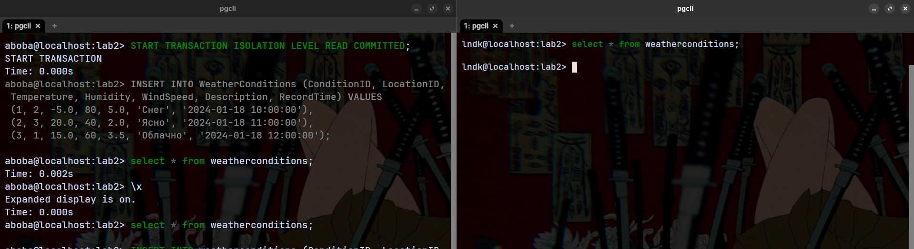
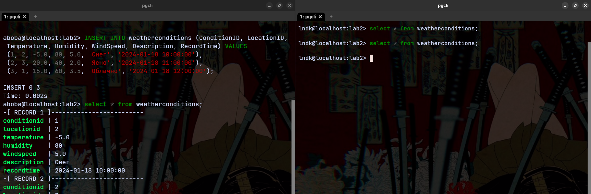
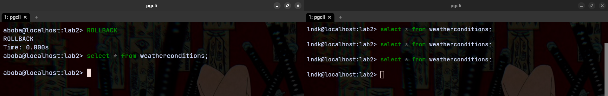
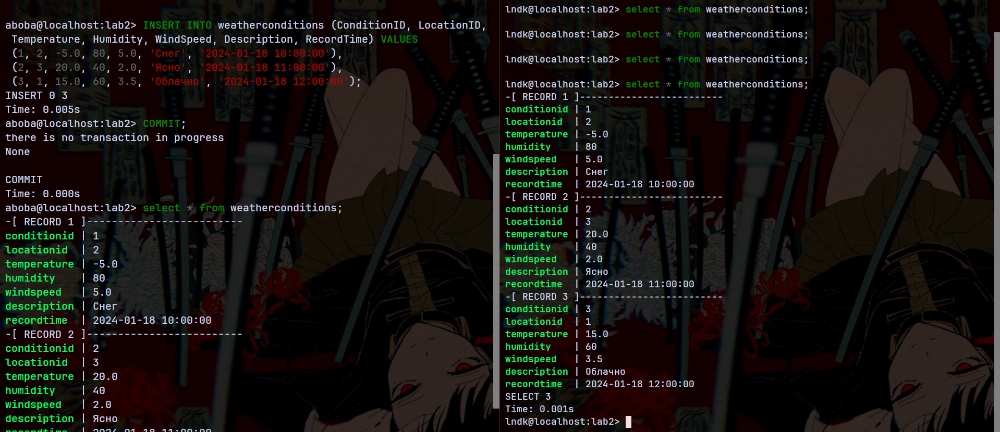
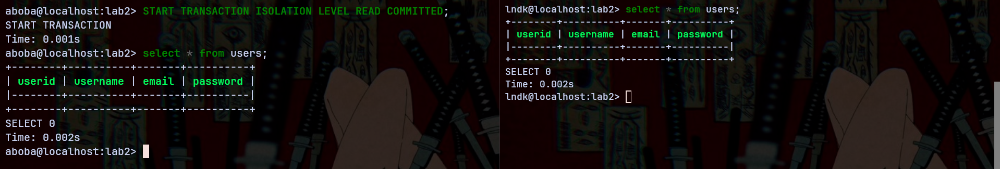
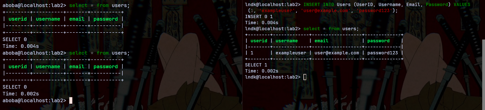
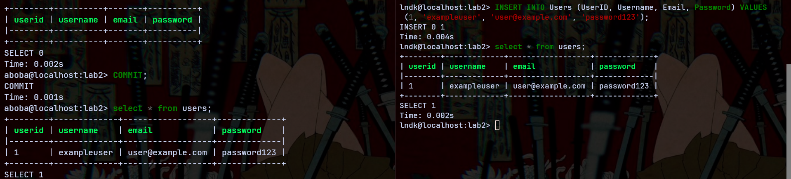
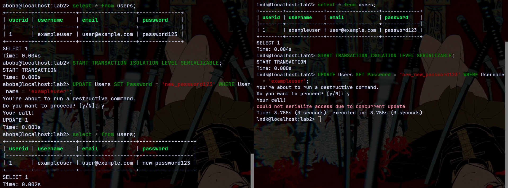
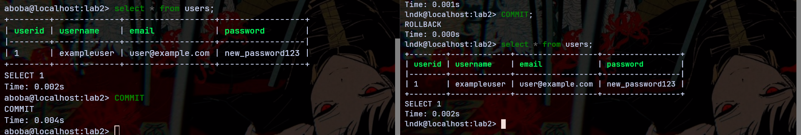

# Лабораторная работа №2-2: «Транзакции. Изоляция транзакций»

Выполнил студент группы Б20-505, Ландаков Павел

## Создать две сессии в Вашей базе данных. Начать транзакцию на уровне изоляции READ COMMITTED в одной из сессий. Изменить и добавить какие-либо данные. Пронаблюдать за изменениями из обеих сессий. Объяснить полученные результаты. Завершить транзакцию инструкцией ROLLBACK. Пронаблюдать за изменениями из обеих сессий. Объяснить полученные результаты.

Одновременно подключимся с двух сессий `aboba` и `lndk`:

### READ COMMITED

Сначала включим режим изоляции для `aboba` и проверим что таблицы пустые:

Далее в сессии `aboba` внесем данные в таблицу, но в сессии `lndk` они не отобразятся т.к. транзакция не была сохранена:

Делаем **ROLLBACK**:

| Внесенные в процессе транзакции изменения откатились и база данных вернулась к тому состоянию, которое было до момента начала транзакции

Вносим те же самые изменения, но завершаем транзакцию при помощи **COMMIT**:

| Транзакция была завершена, изменения внесены в базу данных

### REPEATABLE READ

Начало транзакции, таблица пуста:

Далее в сесии `lndk` вносятся изменения в таблицу users, но в сесии `aboba` они не отображаются:

| Так как в REPEAATABLE READ сессия `aboba` видит данные в том состоянии, в котором они были на момент начала транзакции.

**COMMIT** и данные появились:

### SERIALIZABLE

Попытка одновременного изменения одной и той же записи из разных сессий:

| Уровень изоляции Serializable не дает одновременно изменить одну и ту же строку в разных транзакциях.

Но после того как прописать **COMMIT** в обеих сессиях, то изменение снова станет возможным:

## Заключение

Было исследовано и произведено знакомство с тремя уровнями транзакций в PostgreSQL:
- **READ COMMITTED**: Гарантирует, что каждая транзакция видит только те данные, которые были фиксированы до её начала. Предотвращает "грязное чтение", но не исключает неповторяющиеся чтения или фантомные чтения;
- **REPEATABLE READ**: Обеспечивает, что данные, прочитанные в транзакции, будут одинаковыми при повторном чтении. Предотвращает грязное чтение и неповторяющиеся чтения, но фантомные чтения все еще возможны;
- **SERIALIZABLE**: Наивысший уровень изоляции, который гарантирует полное изолирование транзакции. Предотвращает грязное чтение, неповторяющиеся чтения и фантомные чтения, делая транзакции полностью последовательными.