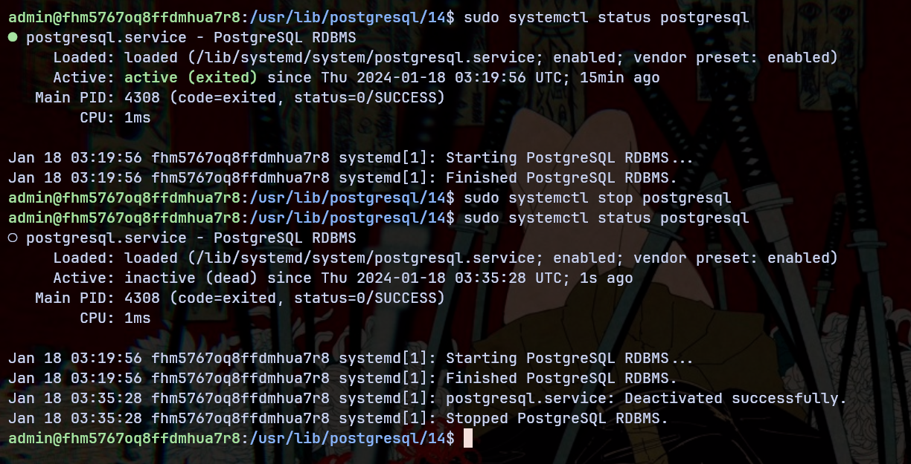
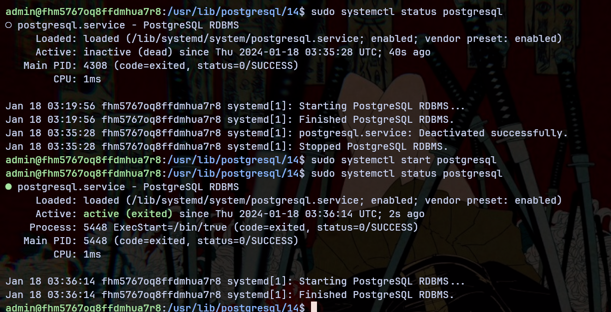
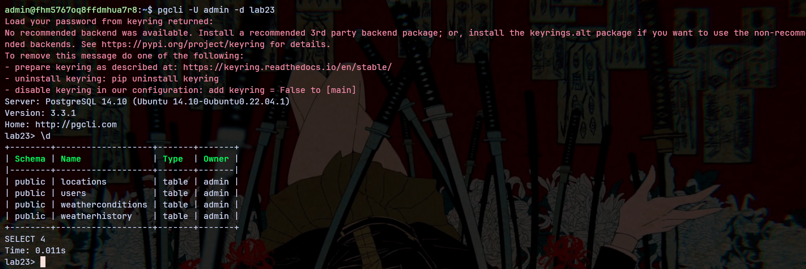
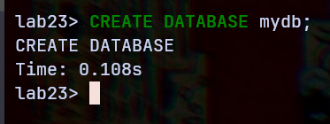
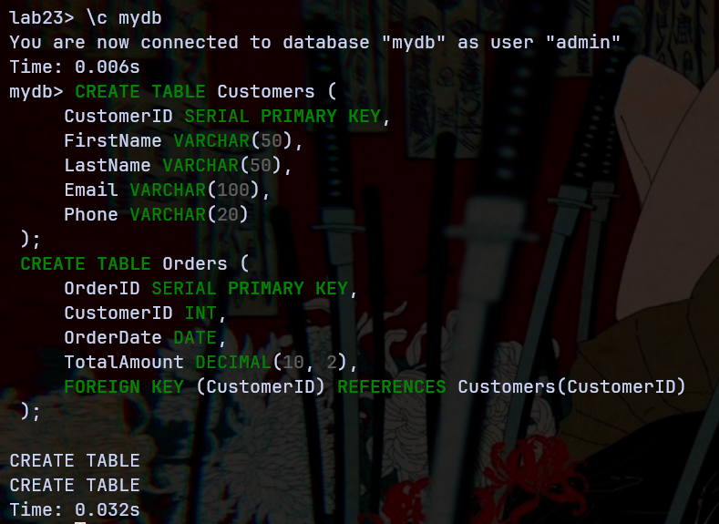
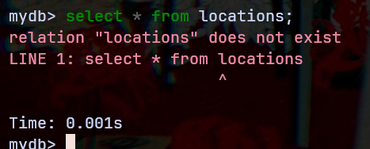
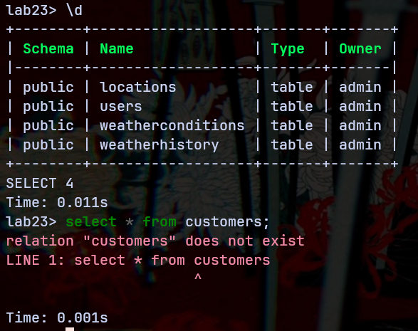

# Лабораторная работа №2-3: «Базовые задачи администрирования СУБД»

Выполнил студент группы Б20-505, Ландаков Павел

## Выяснить, в каком месте файловой системы расположен установленный в предыдущих работах кластер баз данных PostgreSQL

Все исполняемые файлы:
```
admin@fhm5767oq8ffdmhua7r8:~$ pg_config --bindir
>>> /usr/lib/postgresql/14/bin
```

Все данные самой БД:
```
lab23> SHOW data_directory
+-----------------------------+
| data_directory              |
|-----------------------------|
| /var/lib/postgresql/14/main |
+-----------------------------+
```

## Выяснить, какие файлы хранятся в директории кластера базы данных

```
postgres@fhm5767oq8ffdmhua7r8:~/14$ tree main/ -L 1
main/
├── base
├── global
├── pg_commit_ts
├── pg_dynshmem
├── pg_logical
├── pg_multixact
├── pg_notify
├── pg_replslot
├── pg_serial
├── pg_snapshots
├── pg_stat
├── pg_stat_tmp
├── pg_subtrans
├── pg_tblspc
├── pg_twophase
├── PG_VERSION
├── pg_wal
├── pg_xact
├── postgresql.auto.conf
├── postmaster.opts
└── postmaster.pid
```

- **base**: Хранит данные всех пользовательских баз данных.
- **global**: Содержит глобальные данные кластера.
- **pg_commit_ts**: Информация о временных метках фиксации транзакций.
- **pg_dynshmem**: Для динамической разделяемой памяти.
- **pg_logical**: Информация для логической репликации.
- **pg_multixact**: Информация о мульти-транзакциях.
- **pg_notify**: Информация о NOTIFY командах.
- **pg_replslot**: Информация о слотах репликации.
- **pg_serial**: Информация о сериализации транзакций.
- **pg_snapshots**: Экспортированные снимки данных.
- **pg_stat и pg_stat_tmp**: Статистика работы сервера.
- **pg_subtrans**: Управление подтранзакциями.
- **pg_tblspc**: Ссылки на таблицы в пространствах таблиц.
- **pg_twophase**: Данные о двухфазных фиксациях транзакций.
- **PG_VERSION**: Версия PostgreSQL.
- **pg_wal**: Журналы записи операций (WAL).
- **pg_xact**: Файлы журналов транзакций.
- **postgresql.auto.conf**: Параметры конфигурации через ALTER SYSTEM.
- **postmaster.opts и postmaster.pid**: Опции запуска и идентификатор процесса.

## Выяснить, какой командной строкой запущен экземпляр PostgreSQL

```bash
admin@fhm5767oq8ffdmhua7r8:/usr/lib/postgresql/14$ ps -ef | grep postgres
postgres    4280       1  0 03:19 ?        00:00:00 /usr/lib/postgresql/14/bin/postgres -D /var/lib/postgresql/14/main -c config_file=/etc/postgresql/14/main/postgresql.conf
```

## Выполнить штатное завершение работы сервера PostgreSQL



## Вновь запустить экземпляр PostgreSQL вручную



## Подключиться к экземпляру и проверить его работоспособность

Все таблицы и данные сохранились:


## Создать новую базу данных в кластере. Кто её владелец? Какие объекты в ней содержатся?

| По умолчанию владельцем базы данных будет тот, от чьего имени была выполнена команда, иначе можно указать другого владельца при помощи `OWNER`

Базово в свежей базе данных хранятся:
- Системные каталоги
- Системные таблицы
- Шаблоны template0 и template1

## Подключиться к новой базе данных и создать в ней несколько пробных объектов

Подключение к `mydb` и создание пары новых таблиц:


## Убедиться, что из новой базы данных нет доступа к исходной


## Убедиться, что из исходной базы данных нет доступа к новой


## Заключение

В данной лабораторной работе было проведено знакомство с концептом "контейнерных баз данных", были освоены базовые задачи администрирования СУБД и изучены механизмы управления базами данных.