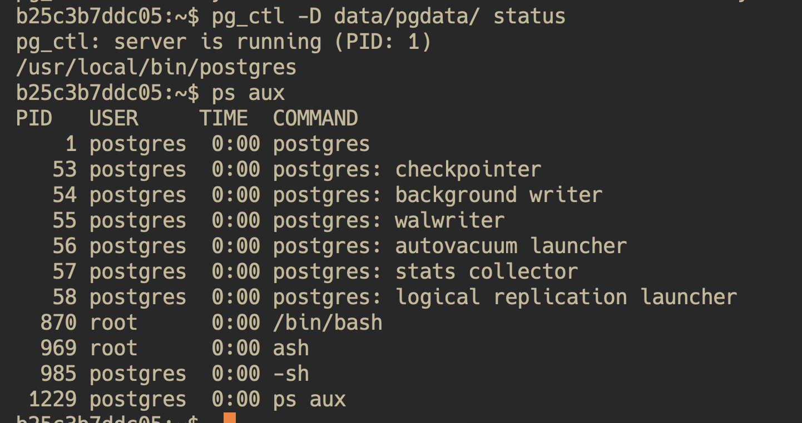
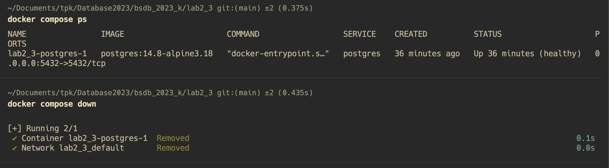
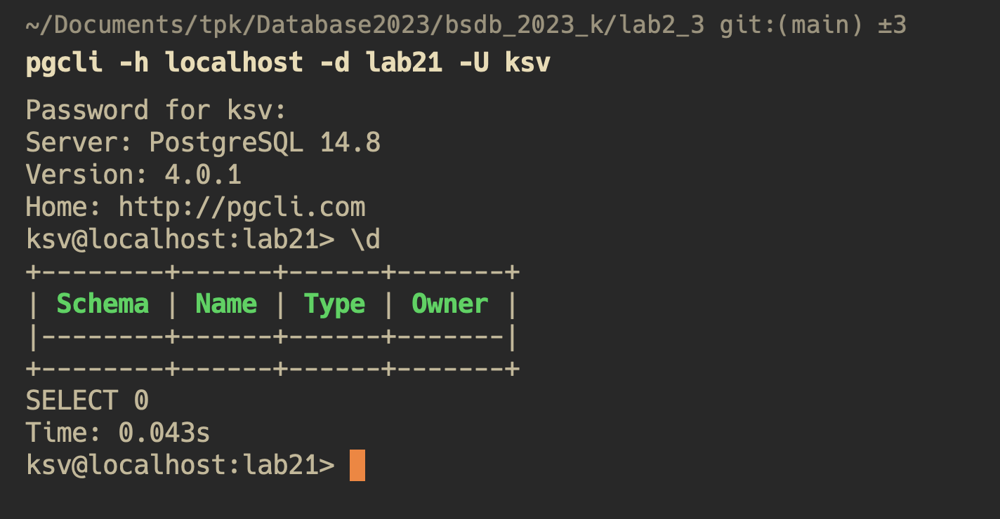

# Отчет лабораторная работа 2_3
## Выполнила Ковригина Софья

## Выяснить,в каком месте файловой системы расположен установленный в предыдущих работах кластер баз данных PostgreSQL

Так как PostgreSQL запускался при помощи docker-compose, то кластер БД может быть примонтирован почти куда угодно в системе, для данной лабораторной работы он был примонтирован в папку `pg_data`.

Использованный в данной лабораторной работе docker-compose.yaml
```yaml
version: "3.9"
services:
  postgres:
    image: postgres:14.8-alpine3.18
    environment:
      POSTGRES_DB: "lab21"
      POSTGRES_USER: "ksv"
      POSTGRES_PASSWORD: "superstrongpassword"
      PGDATA: "/var/lib/postgresql/data/pgdata"
    volumes:
      - ./pg_data:/var/lib/postgresql/data
    ports:
      - "5432:5432"
    healthcheck:
      test: ["CMD-SHELL", "pg_isready -U ksv -d lab21"]
      interval: 10s
      timeout: 5s
      retries: 5
      start_period: 10s
    restart: unless-stopped
    deploy:
      resources:
        limits:
          cpus: '2'
          memory: 4G
```

## Выяснить,какие файлы хранятся в директории кластера базы данных

Структура каталога `pgdata`:
```
pgdata/
├── PG_VERSION
├── base
│   ├── 1
│   ├── 13776
│   ├── 13777
│   └── 16384
├── global
│   ├── 1213
│   ├── 1213_fsm
│   ├── ...
│   ├── pg_control
│   ├── pg_filenode.map
│   └── pg_internal.init
├── pg_commit_ts
├── pg_dynshmem
├── pg_hba.conf
├── pg_ident.conf
├── pg_logical
│   ├── mappings
│   ├── replorigin_checkpoint
│   └── snapshots
├── pg_multixact
│   ├── members
│   └── offsets
├── pg_notify
├── pg_replslot
├── pg_serial
├── pg_snapshots
├── pg_stat
├── pg_stat_tmp
│   ├── db_0.stat
│   ├── db_13777.stat
│   ├── db_16384.stat
│   └── global.stat
├── pg_subtrans
│   └── 0000
├── pg_tblspc
├── pg_twophase
├── pg_wal
│   ├── 000000010000000000000001
│   └── archive_status
├── pg_xact
│   └── 0000
├── postgresql.auto.conf
├── postgresql.conf
├── postmaster.opts
└── postmaster.pid
```

- **base**: подкаталоги с физическими файлами данных для каждой базы данных в кластере PostgreSQL
- **global**: глобальные данные кластера, включая общесистемные таблицы
- **pg_xact**: журналы транзакций
- **pg_wal**: журналы предзаписи
- **pg_multixact**: информация о множественных транзакциях, используемую для управления блокировками на уровне строки
- **pg_subtrans**: информация о подтранзакциях
- **pg_tblspc**: символические ссылки на каталоги таблиц
- **pg_twophase**: данные о двухфазных транзакциях
- **pg_notify**: информация о уведомлениях LISTEN/NOTIFY
- **postgresql.conf**: основной файл конфигурации
- **pg_hba.conf**: файл конфигурации для контроля доступа, определяет, какие пользователи могут подключаться к каким базам данных и каким способом
- **pg_ident.conf**: используется для сопоставления идентификаторов пользователей операционной системы к идентификаторам пользователей базы данных

## Выяснить какой командной строкой запущен экземпляр PostgreSQL

Так как экземпляр PostgreSQL запущен внутри Docker контейнера, то процесс имеет PID=1. И является родительским для всех процессов. Поэтому можно считать что postgres запускается при помощи Docker Engine.

## Выполнить штатное завершение работы сервера PostgreSQL

Контейнер остановлен и БД соответственно

## Вновь запустить экземпляр PostgreSQL вручную
Запущено при помощи `docker compose up`

## Подключиться к экземпляру и проверить его работоспособность


## Создать новую базу данных в кластере. Кто её владелец? Какие объекты в ней содержатся?
Создание новой базы:
```
ksv@localhost:lab21> CREATE DATABASE newdb;
CREATE DATABASE
Time: 0.469s
```

Проверить кто владелец базы:
```
ksv@localhost:lab21> SELECT d.datname as "Name",
        pg_catalog.pg_get_userbyid(d.datdba) as "Owner"
 FROM pg_catalog.pg_database d
 ORDER BY 1;

+-----------+-------+
| Name      | Owner |
|-----------+-------|
| lab21     | ksv   |
| newdb     | ksv   |
| postgres  | ksv   |
| template0 | ksv   |
| template1 | ksv   |
+-----------+-------+
SELECT 5
Time: 0.016s
```
Вледелец новой базы - `ksv`

Список объектов в новой базе:
```SQL
ksv@localhost:lab21> \c newdb
You are now connected to database "newdb" as user "ksv"
Time: 0.109s

+--------------------+-------------------------+------------+------------+------------+----------+-------------+-------------+
| schemaname         | tablename               | tableowner | tablespace | hasindexes | hasrules | hastriggers | rowsecurity |
|--------------------+-------------------------+------------+------------+------------+----------+-------------+-------------|
| pg_catalog         | pg_statistic            | ksv        | <null>     | True       | False    | False       | False       |
| pg_catalog         | pg_type                 | ksv        | <null>     | True       | False    | False       | False       |
| pg_catalog         | pg_foreign_table        | ksv        | <null>     | True       | False    | False       | False       |
| pg_catalog         | pg_authid               | ksv        | pg_global  | True       | False    | False       | False       |
| pg_catalog         | pg_statistic_ext_data   | ksv        | <null>     | True       | False    | False       | False       |
| pg_catalog         | pg_user_mapping         | ksv        | <null>     | True       | False    | False       | False       |
| pg_catalog         | pg_subscription         | ksv        | pg_global  | True       | False    | False       | False       |
| pg_catalog         | pg_attribute            | ksv        | <null>     | True       | False    | False       | False       |
| pg_catalog         | pg_proc                 | ksv        | <null>     | True       | False    | False       | False       |
| pg_catalog         | pg_class                | ksv        | <null>     | True       | False    | False       | False       |
| pg_catalog         | pg_attrdef              | ksv        | <null>     | True       | False    | False       | False       |
| pg_catalog         | pg_constraint           | ksv        | <null>     | True       | False    | False       | False       |
...
```
Только что созданная база содержит такие каталоги как `pg_class`, `pg_attribute`, шаблонные таблицы `template0` и `template1`, и другое.

## Подключиться к новой базе данных и создать в ней несколько пробных объектов
Созданные 3 таблицы в новой базе:
```SQL
ksv@localhost:newdb> \d
+--------+------------+-------+-------+
| Schema | Name       | Type  | Owner |
|--------+------------+-------+-------|
| public | actors     | table | ksv   |
| public | perfomance | table | ksv   |
| public | roles      | table | ksv   |
+--------+------------+-------+-------+
SELECT 3
Time: 0.012s
```