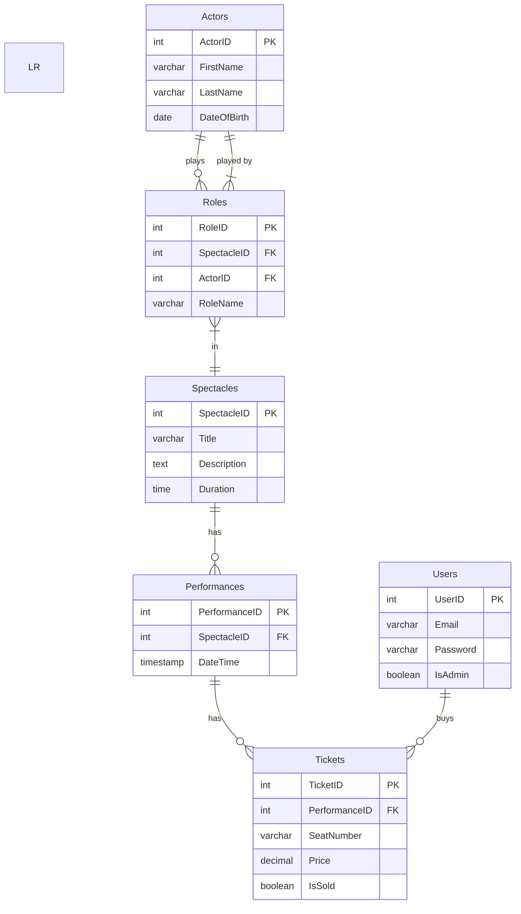

# Лабораторная работа №2-1: «Пользователи. Роли. Привилегии»

## Структура базы данных
```SQL
CREATE TABLE Perfomance (
    PerfID INT PRIMARY KEY,
    Title VARCHAR(255),
    Description TEXT,
    Duration TIME
);

CREATE TABLE Actors (
    ActorID INT PRIMARY KEY,
    FirstName VARCHAR(255),
    LastName VARCHAR(255),
    DateOfBirth DATE
);

CREATE TABLE Roles (
    RoleID INT PRIMARY KEY,
    PerfID INT REFERENCES Perfomance(PerfID),
    ActorID INT REFERENCES Actors(ActorID),
    RoleName VARCHAR(255)
);

CREATE TABLE Performances (
    PerformanceID INT PRIMARY KEY,
    PerfID INT REFERENCES Perfomance(PerfID),
    DateTime TIMESTAMP
);

CREATE TABLE Tickets (
    TicketID INT PRIMARY KEY,
    PerformanceID INT REFERENCES Performances(PerformanceID),
    SeatNumber VARCHAR(255),
    Price DECIMAL,
    IsSold BOOLEAN
);

CREATE TABLE Users (
    UserID INT PRIMARY KEY,
    Email VARCHAR(255),
    Password VARCHAR(255),
    IsAdmin BOOLEAN
);

```

## Диаграмма
