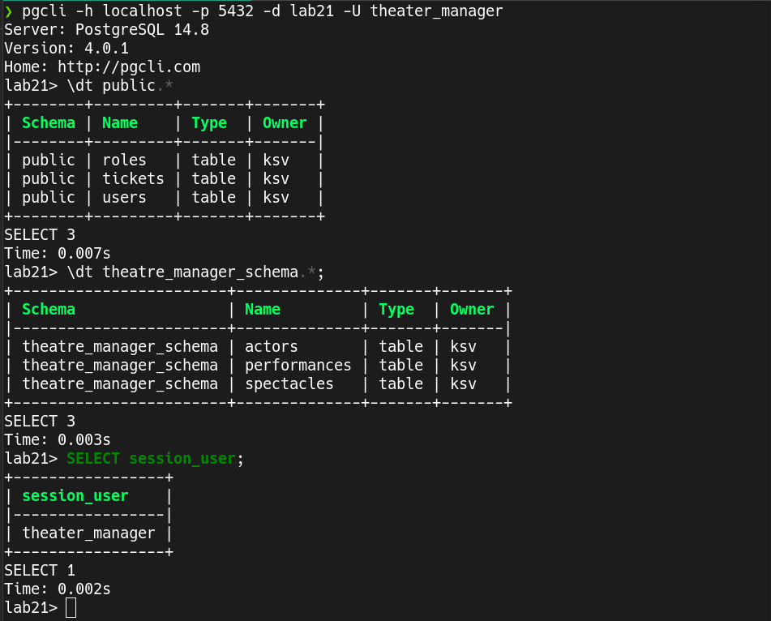

# Лабораторная работа №2-1: «Пользователи. Роли. Привилегии»

## Структура базы данных
```SQL
CREATE TABLE Perfomance (
    PerfID INT PRIMARY KEY,
    Title VARCHAR(255),
    Description TEXT,
    Duration TIME
);

CREATE TABLE Actors (
    ActorID INT PRIMARY KEY,
    FirstName VARCHAR(255),
    LastName VARCHAR(255),
    DateOfBirth DATE
);

CREATE TABLE Roles (
    RoleID INT PRIMARY KEY,
    PerfID INT REFERENCES Perfomance(PerfID),
    ActorID INT REFERENCES Actors(ActorID),
    RoleName VARCHAR(255)
);

CREATE TABLE Performances (
    PerformanceID INT PRIMARY KEY,
    PerfID INT REFERENCES Perfomance(PerfID),
    DateTime TIMESTAMP
);

CREATE TABLE Tickets (
    TicketID INT PRIMARY KEY,
    PerformanceID INT REFERENCES Performances(PerformanceID),
    SeatNumber VARCHAR(255),
    Price DECIMAL,
    IsSold BOOLEAN
);

CREATE TABLE Users (
    UserID INT PRIMARY KEY,
    Email VARCHAR(255),
    Password VARCHAR(255),
    IsAdmin BOOLEAN
);

```

## Диаграмма


## Определить, в какой схеме находятся таблицы Вашей базы данных. 
Это можно определить при помощи запроса:
```SQL
SELECT table_schema, table_name
FROM information_schema.tables
WHERE table_schema NOT IN ('information_schema', 'pg_catalog')
ORDER BY table_schema, table_name;
```
Ответ:
```
+--------------+--------------+
| table_schema | table_name   |
|--------------+--------------|
| public       | actors       |
| public       | performances |
| public       | roles        |
| public       | perfomance   |
| public       | tickets      |
| public       | users        |
+--------------+--------------+
```
###  Следует ли изменить схему? Следует ли создать несколько отдельных схем для выбранной предметной области? Почему?

Базово все объекты добавляются в схему "public", это не является причиной для беспокойств. Можно эти объекты привязать к новым схемам для того чтобы:
 - **улучшить безопасность и огранизовать усправление доступом**: позволяет создать различные уровни доступа, что полезно в больших компаниях с большим количеством работников;
 - **масштабируемости и контроля изменений**: при большом количестве объектов изменений одной из схем не приведет к возможному негативному изменений всех объектов.

Но т.к. рассматривается проект одного единственного театра, то масштабируемость тут необязательна, поэтому можно оставить объекты со стандартными схемами.

## Определить, какие роли нужны для нормального функционирования Вашей базы данных.

Допустим мы хотим увеличить безопасность нашей системы баз данных и создадим роли, при помощи которых можно будет разграничить доступ к таблицам:
- **Администратор базы данных**: имеет полный доступ;
- **Менеджер театра**: имеет доступ к чтению и записи в таблицы `Spectacles`, `Performances`, `Roles`, `Actors`, только чтение из таблицы `Tickets`;
- **Кассир**: чтение из таблиц `Spectacles`, `Performances`, `Roles`, `Actors`, чтение и запись в таблицу `Tickets`;
- **Пользователь сайта**: чтение из таблиц `Spectacles`, `Performances`, `Tickets`.

###  Какие системные и объектные привилегии потребуются каждой роли? Понадобятся ли вложенные роли?

```SQL
-- DBA
CREATE ROLE db_admin WITH LOGIN PASSWORD 'supersecurepassword';
GRANT ALL PRIVILEGES ON DATABASE lab21 TO db_admin;

-- менеджер театра
CREATE ROLE theater_manager WITH LOGIN PASSWORD 'mefistofel';
GRANT SELECT, INSERT, UPDATE ON TABLE spectacles, performances, roles, actors TO theater_manager;
GRANT SELECT ON TABLE tickets TO theater_manager;

-- кассир
CREATE ROLE cashier WITH LOGIN PASSWORD 'not7eleven';
GRANT SELECT ON TABLE spectacles, performances, roles, actors TO cashier;
GRANT SELECT, UPDATE ON TABLE tickets TO cashier;

-- пользователь сайта
CREATE ROLE website_user;
GRANT SELECT ON TABLE spectacles, performances, tickets TO website_user;

-- Вложенные роли по приколу
GRANT cashier TO theater_manager;
```

Также создадим несколько схем:
```SQL
CREATE SCHEMA theatre_manager_schema;
CREATE SCHEMA cashier_schema;
```

Привяжем эти схемы на некоторые таблицы:
```SQL
ALTER TABLE public.actors SET SCHEMA theatre_manager_schema;
ALTER TABLE public.spectacles SET SCHEMA theatre_manager_schema;
```

Выдадим ролям доступ ко всем объектам с этими схемами:
```SQL
GRANT USAGE ON SCHEMA theatre_manager_schema TO theater_manager;
GRANT ALL ON ALL TABLES IN SCHEMA theatre_manager_schema TO theater_manager;

GRANT USAGE ON SCHEMA cashier_schema TO cashier;
GRANT SELECT, UPDATE ON ALL TABLES IN SCHEMA cashier_schema TO cashier;
```

Также установим схемы по умолчанию для каждой роли, чтобы они не указывать полный путь к таблицам каждый раз:
```SQL
ALTER ROLE theater_manager SET search_path TO theatre_manager_schema;
ALTER ROLE cashier SET search_path TO cashier_schema;
```


Теперь роли выглядят так:
```
+------------------------+--------------+
| table_schema           | table_name   |
|------------------------+--------------|
| public                 | roles        |
| public                 | tickets      |
| public                 | users        |
| theatre_manager_schema | actors       |
| theatre_manager_schema | performances |
| theatre_manager_schema | performance  |
+------------------------+--------------+
```

### Попробовать подключиться от лица каждой роли (из тех, которым разрешено подключение к серверу БД). Убедиться, что роль имеет доступ к разрешённым данным и не имеет доступа ко всем остальным.

#### db_admin


#### theater_manager


#### cashier

