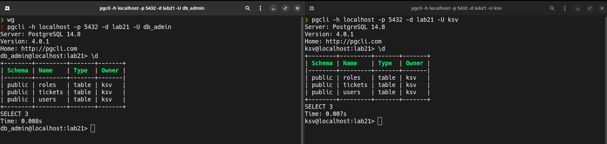
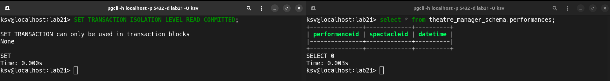
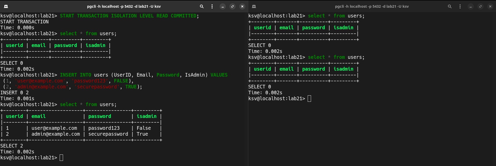
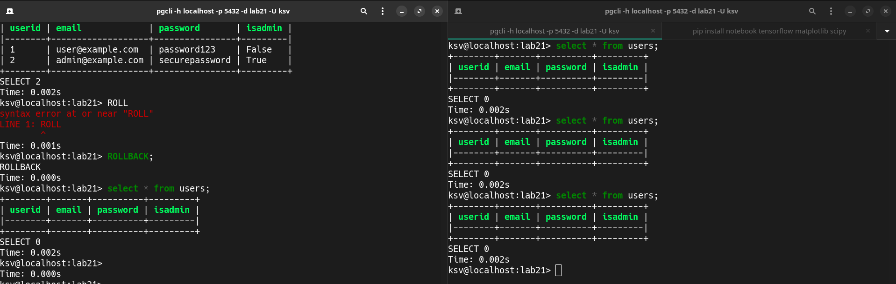
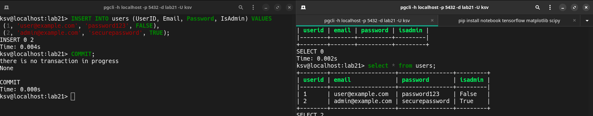
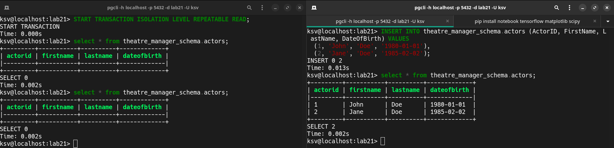
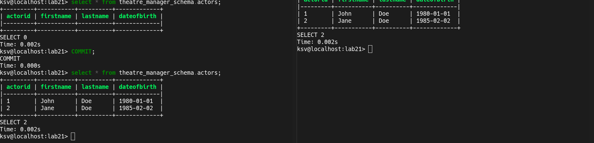
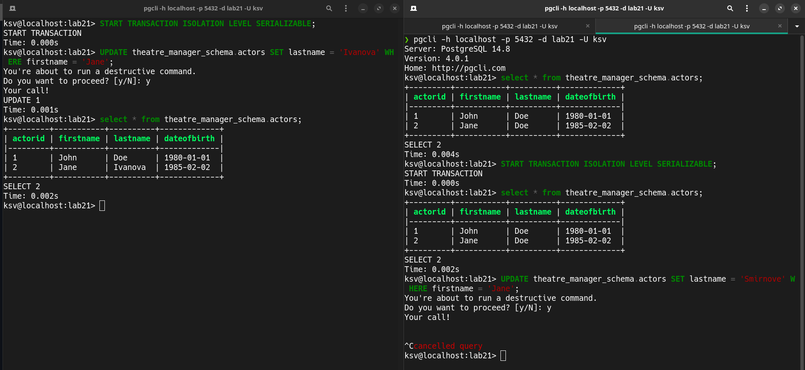
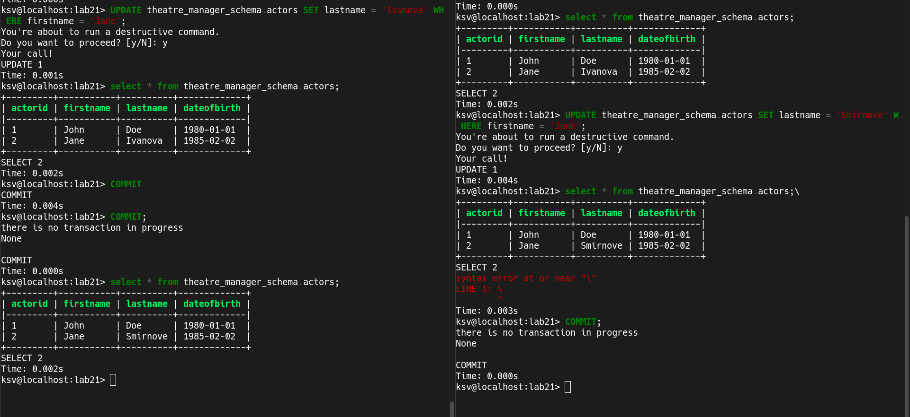

# Лабораторная работа №2-2: «Транзакции. Изоляция транзакций»

Используется та же схема базы данных, что и в лабораторной работе #2.1

Подключимся с двух разных сессий:

| Здесь и далее сессия слева = сессия1, сессия справа = сессия2

## Создать две сессии в Вашей базе данных. Начать транзакцию на уровне изоляции READ COMMITTED в одной из сессий. Изменить и добавить какие-либо данные.

Выставим в сесси 1 уровень изоляции READ COMMITTED, изначально все таблицы пустые:

Далее вставим данные через сессию 1:

Во второй сесси данные не отобразились так как не был совершен COMMIT на вставленные данные. В первой сессии из-за выставленного уровня изоляции мы видим незакоммиченные данные

### Делаем ROLLBACK

Мы отменили транзакцию => откатили изменения в базе данных

### Всё-таки COMMIT'им изменения

Мы сохранили изменения в базе, поэтому изменения стали общедоступны и их видно из любой сессии

## Выполнить те же операции для уровней изоляции REPEATABLE READ и SERIALIZABLE. Объяснить различия

### REPEATABLE READ

Из-за того что мы выставили уровень изоляции `REPEATABLE READ` сессия 1 видит только те изменения, которые были внесены на момент начала транзакции. Чтобы увидеть изменения, внесенные из другой сессии необходимо совершить COMMIT:

Здесь можно увидеть, что данные появились

### SERIALIZABLE

Уровень изоляции `SERIALIZABLE` запрещает одновременное изменение данных в разных сессиях, для того чтобы произвести изменения в сессии 2 небходимо сначала совершить COMMIT в обоих сессиях:

## Заключение:
Были изучены три уровня изоляции в PostgreSQL:
#### 1. READ COMMITTED:
- Транзакция видит только те данные, которые были зафиксированы до её начала.
- Минимизация блокировок, подходит для многих обычных операций.

#### 2. REPEATABLE READ:
- Гарантирует, что любые данные, прочитанные в транзакции, не изменятся в течение всей транзакции.
- Предотвращает феномен неповторяемого чтения, но может привести к более длительным блокировкам.

#### 3. SERIALIZABLE:
- Самый строгий уровень, обеспечивает полную изоляцию транзакции, как если бы они выполнялись последовательно.
- Используется для обеспечения полной последовательности и целостности транзакций, но может сильно снижать параллельность и производительность.