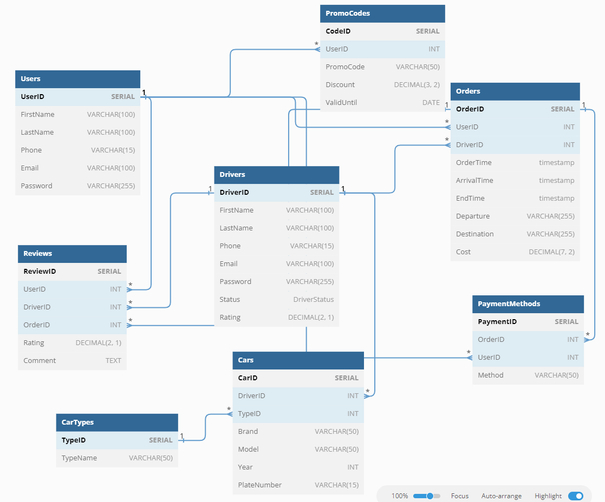

# НИЯУ МИФИ. ИИКС. Лабораторная работа #1 
## Полищук Максим, Б20-505

### Предметная область
Был выбран проект М.Такси (все совпадения всего лишь выдумка и они абсолютно случайны). Были реализованы сущности *Пользователи, Водители, Автомобили, Заказы, Отзывы, Промокоды*. Данная база показывает взаимодействие **водитель такси** <-> **клиент**. 

### Описания таблиц
| Название таблицы | Название поля | Тип данных | Описание | Первичный ключ | Внешний ключ |
| --- | --- | --- | --- | --- | --- |
| Users | UserID | INTEGER | Уникальный идентификатор пользователя | Да | Нет |
| Users | FirstName | TEXT | Имя пользователя | Нет | Нет |
| Users | LastName | TEXT | Фамилия пользователя | Нет | Нет |
| Users | Phone | TEXT | Номер телефона пользователя | Нет | Нет |
| Users | Email | TEXT |Электронная почта пользователя | Нет | Нет |
| Users | Password | TEXT | Хэш пароля пользователя | Нет | Нет |
| Drivers | DriverID | INTEGER | Уникальный идентификатор водителя | Да | Нет |
| Drivers | FirstName | TEXT | Имя водителя | Нет | Нет |
| Drivers | LastName | TEXT | Фамилия водителя | Нет | Нет |
| Drivers | Phone | TEXT | Номер телефона водителя | Нет | Нет |
| Drivers | Email | TEXT | Электронная почта водителя | Нет | Нет |
| Driver | Password | TEXT | Хэш пароля водителя | Нет | Нет |
| Drivers | Status | TEXT | Статус водителя | Нет | Нет |
| Drivers | Rating | REAL | Рейтинг водителя | Нет | Нет |
| CarTypes | TypeID | INTEGER | Уникальный идентификатор типа автомобиля | Да | Нет |
| CarTypes | TypeName | TEXT | Название типа автомобиля | Нет | Нет |
| Cars | CarID | INTEGER | Уникальный идентификатор автомобиля | Да | Нет |
| Cars | DriverID | INTEGER | Идентификатор водителя, к которому принадлежит автомобиль | Нет | Да |
| Cars | TypeID | INTEGER | Идентификатор типа автомобиля | Нет | Да |
| Cars | Brand | TEXT | Бренд автомобиля | Нет | Нет |
| Cars | Model | TEXT | Модель автомобиля | Нет | Нет |
| Cars | Year | INTEGER | Год выпуска автомобиля | Нет | Нет |
| Cars | PlateNumber | TEXT | Номерной знак автомобиля | Нет | Нет |
| Orders | OrderID | INTEGER | Уникальный идентификатор заказа | Да | Нет |
| Orders | UserID | INTEGER | Идентификатор пользователя, сделавшего заказ | Нет | Да |
| Orders | DriverID | INTEGER | Идентификатор водителя, принявшего заказ | Нет | Да |
| Orders | OrderTime | TEXT | Время заказа | Нет | Нет |
| Orders | ArrivalTime | TEXT | Время прибытия | Нет | Нет |
| Orders | EndTime | TEXT | Время окончания поездки | Нет | Нет |
| Orders | Departure | TEXT | Место отправления | Нет | Нет |
| Orders | Destination | TEXT | Место назначения | Нет | Нет |
| Orders | Cost | REAL | Стоимость поездки | Нет | Нет |
| Reviews | ReviewID | INTEGER | Уникальный идентификатор обзора | Да | Нет |
| Reviews | UserID | INTEGER | Идентификатор пользователя, оставившего обзор | Нет | Да |
| Reviews | DriverID | INTEGER | Идентификатор водителя, на который был оставлен обзор | Нет | Да |
| Reviews | OrderID | INTEGER | Идентификатор заказа, для которого был оставлен обзор | Нет | Да |
| Reviews | Rating | REAL | Рейтинг, оставленный пользователем | Нет | Нет |
| Reviews | Comment | TEXT | Комментарий, оставленный пользователем | Нет | Нет |

### Типы связей между таблицами
1. Один ко многим:
    - Связь между таблицей Users и таблицей Orders: Один пользователь (Users) может иметь много заказов (Orders), но каждый заказ может принадлежать только одному пользователю.
    - Связь между таблицей Drivers и таблицей Cars: Один водитель (Drivers) может иметь много автомобилей (Cars), но каждый автомобиль может принадлежать только одному водителю.
    - Связь между таблицей CarTypes и таблицей Cars: Один тип автомобиля (CarTypes) может быть связан с множеством автомобилей (Cars), но каждый автомобиль может иметь только один тип.
2. Один к одному:
    - Связь между таблицей Users и таблицей Reviews: Один пользователь (Users) может оставить только один отзыв (Reviews), и каждый отзыв будет связан с одним пользователем.
    - Связь между таблицей Drivers и таблицей Reviews: Один водитель (Drivers) может иметь много отзывов (Reviews), и каждый отзыв будет связан с одним водителем.
    - Связь между таблицей Cars и таблицей CarTypes: Каждый автомобиль (Cars) будет иметь только один тип автомобиля (CarTypes).

### Диаграмма сущностей

### Доказательство нормальных форм
*Для этого рассмотрим кажду таблицу в отдельности:*
1. Таблица "Users":
    - Каждое поле в таблице "Users" содержит только атомарные значения (нет повторяющихся групп или списков значений).
    - Уникальный идентификатор UserID является первичным ключом и гарантирует уникальность каждой записи в таблице.
    - Нет транзитивных зависимостей: все поля зависят только от полного первичного ключа (UserID).

2. Таблица "Drivers":
    - Каждое поле в таблице "Drivers" содержит только атомарные значения.
    - Уникальный идентификатор DriverID является первичным ключом и гарантирует уникальность каждой записи в таблице.
    - Нет транзитивных зависимостей: все поля зависят только от полного первичного ключа (DriverID).

3. Таблица "CarTypes":
    - Каждое поле в таблице "CarTypes" содержит только атомарные значения.
    - Уникальный идентификатор TypeID является первичным ключом и гарантирует уникальность каждой записи в таблице.
    - Нет транзитивных зависимостей: все поля зависят только от полного первичного ключа (TypeID).

4. Таблица "Cars":
    - Каждое поле в таблице "Cars" содержит только атомарные значения.
    - Уникальный идентификатор CarID является первичным ключом и гарантирует уникальность каждой записи в таблице.
    - Поле DriverID является внешним ключом, связывающим таблицу "Cars" с таблицей "Drivers".
    - Поле TypeID является внешним ключом, связывающим таблицу "Cars" с таблицей "CarTypes".
    - Нет транзитивных зависимостей: все поля зависят только от полного первичного ключа (CarID).

5. Таблица "Orders":
    - Каждое поле в таблице "Orders" содержит только атомарные значения.
    - Уникальный идентификатор OrderID является первичным ключом и гарантирует уникальность каждой записи в таблице.
    - Поле UserID является внешним ключом, связывающим таблицу "Orders" с таблицей "Users".
    - Поле DriverID является внешним ключом, связывающим таблицу "Orders" с таблицей "Drivers".
    - Нет транзитивных зависимостей: все поля зависят только от полного первичного ключа (OrderID).

6. Таблица "Reviews":
    - Каждое поле в таблице "Reviews" содержит только атомарные значения.
    - Уникальный идентификатор ReviewID является первичным ключом и гарантирует уникальность каждой записи в таблице.
    - Поле UserID является внешним ключом, связывающим таблицу "Reviews" с таблицей "Users".
    - Поле DriverID является внешним ключом, связывающим таблицу "Reviews" с таблицей "Drivers".
    - Поле OrderID является внешним ключом, связывающим таблицу "Reviews" с таблицей "Orders".
    - Нет транзитивных зависимостей: все поля зависят только от полного первичного ключа (ReviewID).

=> все таблицы соответствуют третьей нормальной форме (3NF)

### Приложения
[SQL код создания таблиц](./db_init_sqlite.sql)

### Заключение
Была смоделирована структура базы данных для сервиса М.Такси. Были описаны сущности, их атрибуты и связи между ними. Была построена диаграмма сущностей. Было доказано, что база данных находится в третьей нормальной форме.