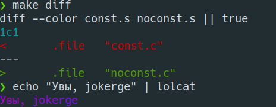

# Отчет по предмету ПАРВПО
## Полищук Максим, Б20-505

## 2. Система
```
             ...-:::::-...                 tpk@tpktower 
          .-MMMMMMMMMMMMMMM-.              ------------ 
      .-MMMM`..-:::::::-..`MMMM-.          OS: Linux Mint 21 x86_64 
    .:MMMM.:MMMMMMMMMMMMMMM:.MMMM:.        Host: VirtualBox 1.2 
   -MMM-M---MMMMMMMMMMMMMMMMMMM.MMM-       Kernel: 5.15.0-70-generic 
 `:MMM:MM`  :MMMM:....::-...-MMMM:MMM:`    Uptime: 1 hour, 46 mins 
 :MMM:MMM`  :MM:`  ``    ``  `:MMM:MMM:    Packages: 2391 (dpkg), 8 (flatpak), 5 (snap) 
.MMM.MMMM`  :MM.  -MM.  .MM-  `MMMM.MMM.   Shell: zsh 5.8.1 
:MMM:MMMM`  :MM.  -MM-  .MM:  `MMMM-MMM:   Resolution: 1920x1080 
:MMM:MMMM`  :MM.  -MM-  .MM:  `MMMM:MMM:   DE: Cinnamon 5.4.12 
:MMM:MMMM`  :MM.  -MM-  .MM:  `MMMM-MMM:   WM: Mutter 
.MMM.MMMM`  :MM:--:MM:--:MM:  `MMMM.MMM.   WM Theme: Mint-Y 
 :MMM:MMM-  `-MMMMMMMMMMMM-`  -MMM-MMM:    Theme: Adapta-Nokto [GTK2/3] 
  :MMM:MMM:`                `:MMM:MMM:     Icons: Mint-Y [GTK2/3] 
   .MMM.MMMM:--------------:MMMM.MMM.      Terminal: gnome-terminal 
     '-MMMM.-MMMMMMMMMMMMMMM-.MMMM-'       CPU: 12th Gen Intel i5-12400F (6) @ 2.496GHz 
       '.-MMMM``--:::::--``MMMM-.'         GPU: 00:02.0 VMware SVGA II Adapter 
            '-MMMMMMMMMMMMM-'              Memory: 3581MiB / 9937MiB 
               ``-:::::-``
```
Процессор: Intel Alder Lake 12400f
Комплилятор: gcc (Ubuntu 11.3.0-1ubuntu1~22.04.1) 11.3.0

## 2.1 Сравнение конвенций о вызовах
Была разработана простая программа, в которой производится вызов функции и сложение всех чисел от 1 до 100. Созданы три варианта для разных концепций о вызовах `fastcall`, `cdecl`, `stdcall`. 

Чтобы запустить тестирование:
```bash
make all
chmod +x scripts/benchmark.sh
cd scripts && ./benchmark.sh
```
После этого в папке `asm` будут лежать ассемблерный вид исполняемых файлов, а в `binary` находятся бинарные исполняемые файлы.

Чтобы увидеть разницу в ассемблерных командах можно воспользоваться `make_base` и `make_optimized`.

#### Результаты тестирования

| Calling convention      | Base | Optimized (O3) | 
| ----------- | ----------- | ----------- | 
| cdecl      | 1.6752       | 1.6464 |
| fastcall   | 1.6520        | 1.6410 |
| stdcall   | 0.2022        | 0.0411 | 

## 2.2 Добавление const
Были созданы две программы с использованием и без использования `const`.

Вырезка из Wikipedia.org:
```
Однако, в общем случае, использование ключевого слова const в C не оказывает существенного влияния на генерацию ассемблерного кода. 
Компилятор может принимать во внимание const при проведении оптимизаций и проверке правильности кода, 
но сгенерированный ассемблерный код может быть схожим, независимо от того, используется const или нет.
```
Если проанализировать два ассемблерных кода (при помощи `make diff`) можно понять, что **constant** никак не влияет на исполнение программы.



**Запустить тесты**:
```bash
make all
make diff
```

## 2.3 Разыменовывание указателей
#### Использование указателя
Использована небольшая структура:
```C
typedef struct Aboba
{
    int red;
    int green;
    int blue;
    int sus;
} Aboba;
```
Файл - [link](2_3/pointer.c)

####  Без указателя
Использована та же структура, что и в предыдущем пункте.

Файл - [link](2_3/nopointer.c)

#### Результаты тестирования

|             | Указатель   | Без Указателя | 
| ----------- | ----------- | ----------- |
| Без оптимизации | 1.1058 | 0.9869 |
| Оптимизация O3 | 0.0009 | 0.0008 |

**Запустить тесты**:
```bash
make all
chmod +x benchmark.sh
./benchmark.sh
```

## My work is (almost) done
